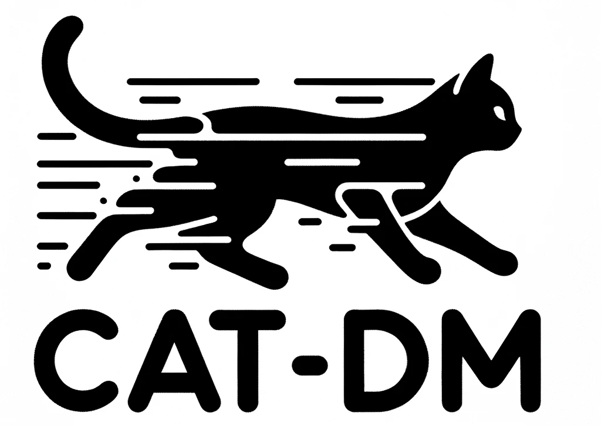

# CAT-DM: Controllable Accelerated Virtual Try-on with Diffusion Model

Jianhao Zeng



## Abstract

Image-based virtual try-on enables users to virtually try on different garments by altering original clothes in their photographs. Generative Adversarial Networks (GANs) dominate the research field in image-based virtual try-on, but have not resolved problems such as unnatural deformation of garments and the blurry generation quality. Recently, diffusion models have emerged with surprising performance across various image generation tasks. While the generative quality of diffusion models is impressive, achieving controllability poses a significant challenge when applying it to virtual try-on tasks and multiple denoising iterations limit its potential for real-time applications. In this paper, we propose Controllable Accelerated virtual Try-on with Diffusion Model called CAT-DM. To enhance the controllability, a basic diffusion-based virtual try-on network is designed, which utilizes ControlNet to introduce additional control conditions and improves the feature extraction of garment images. In terms of acceleration, CAT-DM initiates a reverse denoising process with an implicit distribution generated by a pre-trained GAN-based model. Compared with previous try-on methods based on diffusion models, CAT-DM not only retains the pattern and texture details of the in-shop garment but also reduces the sampling steps without compromising generation quality. Extensive experiments demonstrate the superiority of CAT-DM against both GAN-based and diffusion-based methods in producing more realistic images and accurately reproducing garment patterns.

## Hardware Requirement

Our experiments were conducted on two NVIDIA GeForce RTX 4090 graphics cards, with a single RTX 4090 having 24GB of video memory. Please note that our model cannot be trained on graphics cards with less video memory than the RTX 4090.

## Environment Requirement

1.   Clone the repository

```bash
git clone https://github.com/zengjianhao/FC-VTON
```

2.   A suitable `conda` environment named `FC-VTON` can be created and activated with:

```bash
conda env create -f environment.yaml
conda activate FC-VTON
```

-   If you want to change the name of the environment you created, you need to modify the `name` in both `environment.yaml` and `setup.py`.
-   You need to make sure that `conda` is installed on your computer.
-   If there is a network error, try updating the environment using `conda env update -f environment.yaml`.

3.   Installing xFormers：

```bash
git clone https://github.com/facebookresearch/xformers.git
cd xformers
git submodule update --init --recursive
pip install -r requirements.txt
pip install -U xformers
cd ..
rm -rf xformers
```

4.   open `src/taming-transformers/taming/data/utils.py`, delete `from torch._six import string_classes`, and change `elif isinstance(elem, string_classes):` to `elif isinstance(elem, str):`

## Dataset Preparing

### DressCode

1.   Download the [DressCode](https://github.com/aimagelab/dress-code) dataset
2.   Generate the mask images and the agnostic images

```bash
# Generate the dresses dataset mask images and the agnostic images
python tools/dresscode_mask.py DatasetPath/dresses DatasetPath/dresses/mask 
# Generate the lower_body dataset mask images and the agnostic images
python tools/dresscode_mask.py DatasetPath/lower_body DatasetPath/lower_body/mask DatasetPath/lower_body/agnostic
# Generate the upper_body dataset mask images and the agnostic images
python tools/dresscode_mask.py DatasetPath/upper_body DatasetPath/upper_body/mask DatasetPath/upper_body/agnostic
```

### VITON-HD

1.  Download the [VITON-HD](https://github.com/shadow2496/VITON-HD) dataset
2.  Generate the mask images

```bash
# Generate the train dataset mask images
python tools/viton_mask.py DatasetPath/train DatasetPath/train/mask
# Generate the test dataset mask images
python tools/viton_mask.py DatasetPath/test DatasetPath/test/mask
```

## Pretrain Model

1.   Download the [Paint-by-Example](https://drive.google.com/file/d/15QzaTWsvZonJcXsNv-ilMRCYaQLhzR_i/view) model
2.   Download the [divov2 ViT-L/14](https://dl.fbaipublicfiles.com/dinov2/dinov2_vitl14/dinov2_vitl14_pretrain.pth) model
3.   Make the ControlNet model
     -   DressCode: `python tools/add_control.py checkpoints/pbe.ckpt checkpoints/pbe-dim5.ckpt configs/train-dresscode.yaml`
     -   VITON-HD: `python tools/add_control.py checkpoints/pbe.ckpt checkpoints/pbe-dim6.ckpt configs/train-viton.yaml`

## Testing

#### DressCode

```bash
bash test-dresscode.sh
```

### VITON-HD

```bash
bash test-viton.sh
```

## Training

### DressCode

```bash
bash train-dresscode.sh
```

### VITON-HD

```bash
bash train-viton.sh
```
